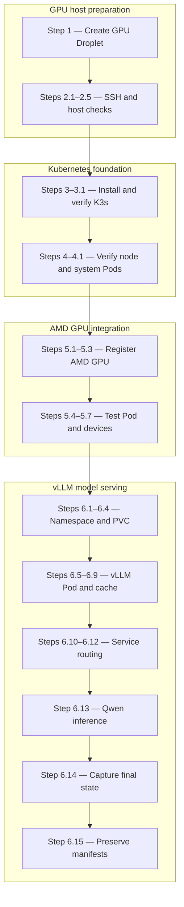

# vLLM ROCm on K3s Lab Cheatsheet

This is a living record of the commands and decisions used to deploy the proven vLLM/ROCm setup on a single-node Kubernetes environment. It will be converted to PDF after the exercise is complete.

## How experiment output is recorded

- Outputs labeled **Observed result** come from this lab's actual command results; they are not generic expected output.
- Short outputs are kept verbatim.
- Long outputs are condensed to the fields that prove the checkpoint passed, so the final cheatsheet remains readable.
- Public IP addresses and other environment-specific details that should not be published are omitted or replaced with placeholders.
- Errors and troubleshooting results will be retained when they materially explain a decision or fix.

## Current environment

- Cloud: DigitalOcean
- Region: Atlanta (`ATL1`)
- Hostname: `my-rocm-k8s-proj`
- GPU: 1 AMD Instinct MI300X VF, 192 GB VRAM (`gfx942`)
- Compute: 20 vCPU, 240 GB RAM
- Storage: 720 GB NVMe boot disk and 5 TB NVMe scratch disk
- Base image: ROCm 7.1 on Ubuntu 24.04 LTS
- Kubernetes distribution: K3s, single-node server
- Droplet rate at creation: $1.99/hour

> Destroy the Droplet when the lab session is over. Powering it off does not stop DigitalOcean billing.

## Architecture decision

The original plan was a DigitalOcean Kubernetes (DOKS) cluster with one CPU worker and one MI300X GPU worker. DOKS requires at least one CPU node pool in addition to a GPU pool. Basic, CPU-Optimized, and General Purpose CPU plans were unavailable in `ATL1`, so the lab uses a single MI300X Droplet running K3s instead.

## Step 1: Create the AMD GPU Droplet

In the DigitalOcean control panel:

1. Choose **Create → Droplets**.
2. Select region **Atlanta (`ATL1`)**.
3. Select the **GPU** machine category and **AMD MI300X**.
4. Select the **ROCm 7.1** Marketplace image.
5. Select **SSH Key** authentication and choose the existing public key.
6. Set quantity to `1`.
7. Set a recognizable hostname. This lab uses `my-rocm-k8s-proj`.
8. Leave automated backups disabled to avoid an additional charge.
9. Enable free improved metrics and monitoring if desired.
10. Do not add paid block storage or other paid options.
11. Create the Droplet and wait for its status to become **Active**.

## Step 2: Connect to and verify the Droplet

### 2.1 Load the SSH key on the Ubuntu laptop

Run these commands on the local laptop before connecting:

```bash
eval "$(ssh-agent -s)"
ssh-add ~/.ssh/id_ed25519
```

- `ssh-agent` starts an in-memory agent for the current shell.
- `ssh-add` loads the private Ed25519 key into that agent.

### 2.2 Connect to the Droplet

```bash
ssh root@<DROPLET_IP>
```

On the first connection, confirm the host fingerprint only after checking that the IP is the Droplet's address in the DigitalOcean control panel.

Do not put the Droplet IP or private SSH key in public documentation.

### 2.3 Verify the host identity and user

Run on the Droplet:

```bash
hostname
whoami
```

Observed result:

```text
my-rocm-k8s-proj
root
```

### 2.4 Verify that ROCm sees the MI300X

```bash
rocm-smi --showproductname
```

Important observed values:

```text
Card Series: AMD Instinct MI300X VF
GFX Version: gfx942
```

`VF` identifies the cloud virtual function and is expected for this Droplet.

### 2.5 Verify the operating system

```bash
cat /etc/os-release
```

Important observed values:

```text
PRETTY_NAME="Ubuntu 24.04.4 LTS"
VERSION_CODENAME=noble
```

## Step 3: Install K3s

Run the official K3s quick-start installer on the Droplet:

```bash
curl -sfL https://get.k3s.io | sh -
```

This installs a single-node K3s server, configures a `systemd` service, and starts the Kubernetes control plane and worker components.

### 3.1 Verify the K3s service

```bash
systemctl status k3s --no-pager
```

Observed result:

```text
Loaded: loaded (...; enabled; ...)
Active: active (running)
```

The successful `ExecStartPre` entries also confirm that the `br_netfilter` and `overlay` kernel modules loaded.

## Step 4: Verify Kubernetes cluster readiness

Run:

```bash
kubectl get nodes -o wide
```

Observed result:

```text
NAME               STATUS   ROLES           VERSION
my-rocm-k8s-proj   Ready    control-plane   v1.36.3+k3s1
```

Other observed details:

- OS: Ubuntu 24.04.4 LTS
- Container runtime: containerd 2.3.2-k3s2
- Node status: `Ready`

### Why the GPU Droplet appears as a Kubernetes node

The DigitalOcean Droplet is the underlying virtual machine. Installing the K3s server also installs and starts the node-side Kubernetes components on that same machine. The K3s agent/kubelet registers the machine with the Kubernetes API, which creates a Kubernetes `Node` object named after the host: `my-rocm-k8s-proj`.

In this single-node lab, one machine performs both roles:

- **Control plane:** runs the Kubernetes API and manages cluster state.
- **Worker node:** runs containers and application Pods through containerd.

The `control-plane` role shown by `kubectl` does not mean the node is control-plane-only. K3s leaves its single server node schedulable, so application Pods can run on it.

The node currently represents the host, not yet its GPU capacity. The AMD Kubernetes device plugin will later discover `/dev/kfd` and `/dev/dri` and advertise the MI300X as an allocatable GPU resource on this node.

### 4.1 Verify the Kubernetes system Pods

Run:

```bash
kubectl get pods -A
```

Observed system workloads:

| Workload | Status | Purpose |
| --- | --- | --- |
| `coredns` | `Running` | Provides DNS-based service discovery inside the cluster. |
| `local-path-provisioner` | `Running` | Dynamically provisions local persistent volumes. |
| `metrics-server` | `Running` | Collects node and Pod resource metrics. |
| `traefik` | `Running` | Provides the default K3s ingress controller. |
| `svclb-traefik` | `Running` | Implements K3s service load-balancer support for Traefik. |
| `helm-install-traefik-crd` | `Completed` | One-time Job that installed Traefik CRDs. |
| `helm-install-traefik` | `Completed` | One-time Job that installed Traefik. |

`Running` is the expected state for the long-lived system Pods. `Completed` is the expected successful state for the two one-time Helm installation Jobs. No system Pod is `Pending`, `Failed`, `CrashLoopBackOff`, or `ImagePullBackOff`, so the base K3s cluster is healthy.

## Step 5: Expose the AMD GPU to Kubernetes

The host driver and ROCm can already see the MI300X, but Kubernetes does not yet advertise it as an allocatable resource. The next stage is to install the AMD Kubernetes device plugin and verify that the node reports:

### 5.1 Install the AMD Kubernetes device plugin

Run:

```bash
kubectl apply -f https://raw.githubusercontent.com/ROCm/k8s-device-plugin/master/k8s-ds-amdgpu-dp.yaml
```

Observed result:

```text
daemonset.apps/amdgpu-device-plugin-daemonset created
```

The manifest creates a Kubernetes `DaemonSet`. A DaemonSet ensures that a copy of the device-plugin Pod runs on each eligible node. On this single-node cluster, the expected desired Pod count is `1`.

The plugin discovers the AMD GPU devices on the host, registers them with the kubelet, and allows the node to advertise the extended resource `amd.com/gpu`. It does not install the ROCm host driver; the ROCm 7.1 Droplet image already provides that layer.

### 5.2 Verify the device-plugin DaemonSet

Run:

```bash
kubectl get daemonset amdgpu-device-plugin-daemonset -n kube-system
```

Observed result:

```text
NAME                             DESIRED   CURRENT   READY   UP-TO-DATE   AVAILABLE
amdgpu-device-plugin-daemonset   1         1         1       1            1
```

All five counts being `1` confirms that Kubernetes wants one device-plugin Pod, created it from the current DaemonSet definition, and sees it as ready and available. The `kubernetes.io/arch=amd64` node selector matches this Droplet's CPU architecture.

This proves that the device-plugin workload is healthy. GPU discovery is verified separately by checking the node's advertised capacity.

### 5.3 Verify that Kubernetes advertises the GPU

Run:

```bash
kubectl get node my-rocm-k8s-proj \
  -o jsonpath='Capacity: {.status.capacity.amd\.com/gpu}{"\n"}Allocatable: {.status.allocatable.amd\.com/gpu}{"\n"}'
```

Observed result:

```text
Capacity: 1
Allocatable: 1
```

- **Capacity** is the total number of AMD GPUs discovered on the node.
- **Allocatable** is the number Kubernetes can currently offer to Pods after any system reservations.

Both values being `1` confirms that the AMD device plugin discovered the MI300X and registered it with the kubelet as the extended resource:

```text
amd.com/gpu: 1
```

Kubernetes can now schedule a Pod that requests the GPU with:

```yaml
resources:
  limits:
    amd.com/gpu: 1
```

This check proves Kubernetes knows about the GPU. It does not yet prove that a scheduled container can access the device successfully; a GPU test Pod is the next checkpoint.

### 5.4 Create a temporary GPU test Pod

Run:

```bash
kubectl apply -f - <<'EOF'
apiVersion: v1
kind: Pod
metadata:
  name: amd-gpu-test
spec:
  restartPolicy: Never
  containers:
    - name: amd-gpu-test
      image: ubuntu:24.04
      command: ["sh", "-c"]
      args:
        - |
          echo "Allocated AMD devices:"
          ls -l /dev/kfd /dev/dri
          sleep 600
      resources:
        limits:
          amd.com/gpu: 1
EOF
```

Observed result:

```text
pod/amd-gpu-test created
```

This result confirms that the Kubernetes API accepted the Pod definition. The Pod explicitly requests one `amd.com/gpu` resource, so the scheduler must place it on a node with an available AMD GPU.

Creation alone does not prove that the Pod was scheduled, that its container started, or that `/dev/kfd` and `/dev/dri` are visible inside it. Those outcomes are verified in the next checkpoint.

### 5.5 Verify that the GPU test Pod is scheduled and started

Run:

```bash
kubectl get pod amd-gpu-test -o wide
```

Observed result:

```text
NAME           READY   STATUS    RESTARTS   AGE    IP           NODE               NOMINATED NODE   READINESS GATES
amd-gpu-test   1/1     Running   0          102s   10.42.0.10   my-rocm-k8s-proj   <none>           <none>
```

This confirms that:

- The scheduler placed the Pod on `my-rocm-k8s-proj`, the node advertising `amd.com/gpu: 1`.
- The container started successfully and is ready (`1/1`).
- The Pod is healthy (`Running`) and has not restarted.
- Kubernetes assigned the Pod an internal cluster IP, `10.42.0.10`.

This proves that Kubernetes can schedule and start a Pod requesting the AMD GPU. Device visibility inside the container is verified separately from the Pod's logs.

### 5.6 Verify AMD device visibility inside the test container

Run:

```bash
kubectl logs amd-gpu-test
```

Observed result:

```text
Allocated AMD devices:
crw-rw---- 1 root  992 237, 0 Aug  9 02:02 /dev/kfd

/dev/dri:
total 0
crw-rw---- 1 root video 226,   1 Aug  9 02:02 card1
crw-rw---- 1 root   992 226, 129 Aug  9 02:02 renderD129
```

This confirms that the AMD device plugin exposed the required host device nodes inside the GPU-allocated container:

- `/dev/kfd` is the **Kernel Fusion Driver** interface used by ROCm compute workloads to communicate with the GPU.
- `/dev/dri/card1` is the GPU's DRM card device.
- `/dev/dri/renderD129` is the render/compute device used for unprivileged GPU access.

The numeric group ID `992` appears because the minimal Ubuntu container does not have the host's corresponding group name in its `/etc/group`; this is not an error. The device files have read/write permission for their owner and group, and this test container runs as `root`.

Together with the earlier `amd.com/gpu: 1` capacity check and the Pod's `Running` status, this proves that Kubernetes can discover, allocate, schedule, and expose the MI300X device to a container. It does not yet execute a ROCm compute operation because the lightweight `ubuntu:24.04` test image does not include the ROCm tools. The vLLM/ROCm deployment will provide that end-to-end workload test.

### 5.7 Delete the temporary GPU test Pod

Run:

```bash
kubectl delete pod amd-gpu-test
```

Observed result:

```text
pod "amd-gpu-test" deleted from default namespace
```

Deleting the temporary Pod releases its request for `amd.com/gpu: 1`. The MI300X remains registered with Kubernetes and is now available for the vLLM Pod. Deleting this Pod does not remove the AMD device-plugin DaemonSet or the node's advertised GPU capacity.

## Step 6: Deploy vLLM

### 6.1 Create a dedicated namespace

Run:

```bash
kubectl create namespace vllm
```

Observed result:

```text
namespace/vllm created
```

The namespace was created successfully. It gives the vLLM application its own logical area in the cluster, separate from K3s system workloads in `kube-system` and from temporary experiments in `default`.

The namespace does not create a separate node or reserve CPU, memory, or GPU resources. The vLLM Pod will still run on `my-rocm-k8s-proj`; its namespace simply organizes namespaced objects such as the Deployment, Service, and model-cache PersistentVolumeClaim.

### 6.2 Verify the default storage class

Run:

```bash
kubectl get storageclass
```

Observed result:

```text
NAME                   PROVISIONER             RECLAIMPOLICY   VOLUMEBINDINGMODE      ALLOWVOLUMEEXPANSION   AGE
local-path (default)   rancher.io/local-path   Delete          WaitForFirstConsumer   false                  46m
```

This confirms that K3s installed `local-path` as the cluster's default dynamic storage provisioner. A PersistentVolumeClaim that does not explicitly name a storage class will therefore use storage local to `my-rocm-k8s-proj`.

The important fields are:

- `Delete`: when a bound PersistentVolumeClaim is deleted, Kubernetes also removes the dynamically provisioned PersistentVolume and its associated local data. Keep anything irreplaceable outside this cache.
- `WaitForFirstConsumer`: Kubernetes waits until a Pod uses the claim before provisioning and binding the volume. A newly created claim may therefore remain `Pending` until the vLLM Pod is scheduled; that is expected.
- `ALLOWVOLUMEEXPANSION=false`: this storage class cannot enlarge an existing claim in place. Choose a suitable initial cache size or recreate the cache claim later if more space is needed.

For this lab, the volume will hold the downloaded Hugging Face model cache. It is node-local rather than network storage, which is appropriate for this single-node cluster but would require a different storage design for a multi-node or highly available deployment.

### 6.3 Create the model-cache PersistentVolumeClaim

Run:

```bash
kubectl apply -f - <<'EOF'
apiVersion: v1
kind: PersistentVolumeClaim
metadata:
  name: model-cache
  namespace: vllm
spec:
  accessModes:
    - ReadWriteOnce
  storageClassName: local-path
  resources:
    requests:
      storage: 20Gi
EOF
```

Observed result:

```text
persistentvolumeclaim/model-cache created
```

This confirms that the Kubernetes API accepted a request for a `20Gi` persistent volume named `model-cache` in the `vllm` namespace. The claim uses the `local-path` storage class and can be mounted read/write by one node at a time (`ReadWriteOnce`), which is appropriate for this single-node lab.

At this point, the claim has been created but its binding state has not yet been verified. Because `local-path` uses `WaitForFirstConsumer`, `Pending` is expected until a Pod that mounts this claim is scheduled. The vLLM Pod will be that first consumer.

### 6.4 Verify the model-cache claim before its first consumer

Run:

```bash
kubectl get pvc model-cache -n vllm
```

Observed result:

```text
NAME          STATUS    VOLUME   CAPACITY   ACCESS MODES   STORAGECLASS   VOLUMEATTRIBUTESCLASS   AGE
model-cache   Pending                                      local-path     <unset>                 115s
```

This `Pending` state is expected and healthy at this stage. The `local-path` storage class uses `WaitForFirstConsumer`, so Kubernetes deliberately postpones provisioning a PersistentVolume until it knows which node will run a Pod that mounts the claim.

The blank `VOLUME`, `CAPACITY`, and `ACCESS MODES` fields show that no PersistentVolume has been provisioned or bound yet. `<unset>` under `VOLUMEATTRIBUTESCLASS` is also normal; this lab does not use a VolumeAttributesClass.

When the vLLM Pod is created, the scheduler will select `my-rocm-k8s-proj`. The local-path provisioner can then create node-local storage there and bind the claim. After that, the PVC status should change from `Pending` to `Bound`.

### 6.5 Create the vLLM Deployment

Run:

```bash
kubectl apply -f - <<'EOF'
apiVersion: apps/v1
kind: Deployment
metadata:
  name: vllm-server
  namespace: vllm
spec:
  replicas: 1
  selector:
    matchLabels:
      app: vllm-server
  template:
    metadata:
      labels:
        app: vllm-server
    spec:
      containers:
        - name: vllm
          image: vllm/vllm-openai-rocm:latest
          imagePullPolicy: IfNotPresent
          args:
            - Qwen/Qwen2.5-0.5B-Instruct
            - --host
            - 0.0.0.0
            - --port
            - "8000"
            - --dtype
            - bfloat16
            - --max-model-len
            - "4096"
            - --gpu-memory-utilization
            - "0.5"
            - --generation-config
            - vllm
          ports:
            - name: http
              containerPort: 8000
          securityContext:
            seccompProfile:
              type: Unconfined
            capabilities:
              add:
                - SYS_PTRACE
          resources:
            requests:
              cpu: "4"
              memory: 16Gi
              amd.com/gpu: "1"
            limits:
              cpu: "16"
              memory: 64Gi
              amd.com/gpu: "1"
          volumeMounts:
            - name: model-cache
              mountPath: /root/.cache/huggingface
            - name: shared-memory
              mountPath: /dev/shm
          startupProbe:
            httpGet:
              path: /health
              port: http
            periodSeconds: 10
            failureThreshold: 90
          readinessProbe:
            httpGet:
              path: /health
              port: http
            periodSeconds: 5
          livenessProbe:
            httpGet:
              path: /health
              port: http
            periodSeconds: 10
      volumes:
        - name: model-cache
          persistentVolumeClaim:
            claimName: model-cache
        - name: shared-memory
          emptyDir:
            medium: Memory
            sizeLimit: 8Gi
EOF
```

Observed result:

```text
deployment.apps/vllm-server created
```

This confirms that the Kubernetes API accepted the Deployment manifest and created the `vllm-server` Deployment in the `vllm` namespace. It does not yet prove that the Pod is running or that vLLM is ready.

The Deployment asks Kubernetes to maintain one vLLM replica. Its Pod requests the single `amd.com/gpu` resource, mounts the persistent Hugging Face cache at `/root/.cache/huggingface`, and provides an in-memory `/dev/shm` volume for PyTorch/vLLM. The startup probe allows up to 15 minutes for the large ROCm image and model initialization before Kubernetes considers startup unsuccessful.

The next verification must check three related but independent outcomes:

- whether the Pod was scheduled and what phase it reached;
- whether the `model-cache` claim changed from `Pending` to `Bound`;
- whether the container image, model download, and vLLM startup completed successfully.

### 6.6 Check the initial vLLM Pod state

Run:

```bash
kubectl get pods -n vllm -o wide
```

Observed result:

```text
NAME                           READY   STATUS    RESTARTS   AGE     IP           NODE               NOMINATED NODE   READINESS GATES
vllm-server-7df5777469-8cg7l   0/1     Running   0          2m29s   10.42.0.12   my-rocm-k8s-proj   <none>           <none>
```

This is a healthy intermediate state:

- `STATUS=Running` confirms that Kubernetes scheduled the Pod on `my-rocm-k8s-proj`, created the container, and started its main process.
- `READY=0/1` means the container has not yet passed its startup and readiness checks. It does **not** mean the Pod failed.
- `RESTARTS=0` confirms that the container has not crashed or been restarted.
- `IP=10.42.0.12` is the Pod's internal cluster-network address.

At only 2 minutes and 29 seconds, vLLM may still be initializing the ROCm runtime, downloading `Qwen/Qwen2.5-0.5B-Instruct`, or loading the model onto the MI300X. The Deployment's startup probe permits up to 90 failures at 10-second intervals—approximately 15 minutes—before Kubernetes treats startup as unsuccessful.

The next diagnostic is to inspect the container logs. The logs reveal whether initialization is progressing normally or whether vLLM encountered an image, ROCm, model-download, or startup-argument error.

### 6.7 Confirm that the vLLM health endpoint is responding

Run:

```bash
kubectl logs -n vllm deployment/vllm-server --tail=100
```

The final observed log lines were:

```text
(APIServer pid=1) INFO:     10.42.0.1:33234 - "GET /health HTTP/1.1" 200 OK
(APIServer pid=1) INFO:     10.42.0.1:33236 - "GET /health HTTP/1.1" 200 OK
```

These responses confirm that the vLLM API server is running and its `/health` endpoint is returning HTTP `200 OK`. The source address `10.42.0.1` is on the K3s Pod network; these requests were generated by Kubernetes health probes rather than by an external client.

### 6.8 Verify that the vLLM Pod became ready

Run:

```bash
kubectl get pods -n vllm -o wide
```

Observed result:

```text
NAME                           READY   STATUS    RESTARTS   AGE     IP           NODE               NOMINATED NODE   READINESS GATES
vllm-server-7df5777469-8cg7l   1/1     Running   0          8m21s   10.42.0.12   my-rocm-k8s-proj   <none>           <none>
```

This is the completed startup state:

- `READY=1/1` confirms that the startup and readiness probes passed.
- `STATUS=Running` confirms that the container remains active.
- `RESTARTS=0` confirms that vLLM initialized without a crash/restart cycle.
- `NODE=my-rocm-k8s-proj` confirms that the Pod is running on the MI300X node.

Together, the `200 OK` health responses and `1/1 Running` status prove that the vLLM server successfully started with `Qwen/Qwen2.5-0.5B-Instruct`. They do not yet prove that an OpenAI-compatible inference request succeeds; that will be tested through a Kubernetes Service in the next stage.

### 6.9 Verify that the model-cache claim is bound

Run:

```bash
kubectl get pvc model-cache -n vllm
```

Observed result:

```text
NAME          STATUS   VOLUME                                     CAPACITY   ACCESS MODES   STORAGECLASS   VOLUMEATTRIBUTESCLASS   AGE
model-cache   Bound    pvc-e6b19223-6b73-4d8d-9b1a-a283190cc61e   20Gi       RWO            local-path     <unset>
```

This confirms that the `model-cache` claim changed from `Pending` to `Bound` after the vLLM Pod became its first consumer. The K3s local-path provisioner created the PersistentVolume `pvc-e6b19223-6b73-4d8d-9b1a-a283190cc61e` on the selected node and attached all `20Gi` to the claim.

- `Bound` means the claim is matched to a PersistentVolume and can be mounted by the Pod.
- `RWO` (`ReadWriteOnce`) means the volume can be mounted read/write from one node at a time, which fits this single-node lab.
- `local-path` means the model cache resides on node-local persistent storage rather than inside the container filesystem.
- Restarting or replacing the vLLM Pod can reuse the downloaded Hugging Face model cache while this PVC remains intact.

Because the storage class has a `Delete` reclaim policy, deleting this PVC will also remove its backing PersistentVolume and cached model data. Deleting only the vLLM Pod or Deployment does not delete the PVC.

### 6.10 Create an internal Kubernetes Service for vLLM

Run:

```bash
kubectl apply -f - <<'EOF'
apiVersion: v1
kind: Service
metadata:
  name: vllm-server
  namespace: vllm
spec:
  type: ClusterIP
  selector:
    app: vllm-server
  ports:
    - name: http
      port: 8000
      targetPort: http
EOF
```

Observed result:

```text
service/vllm-server created
```

This confirms that the Kubernetes API accepted the Service manifest and created the `vllm-server` Service in the `vllm` namespace.

The Service provides a stable virtual IP and DNS name for the vLLM API even if Kubernetes later replaces the backing Pod and gives the replacement a different Pod IP. Its selector, `app: vllm-server`, should match the label on the vLLM Pod. The named `targetPort: http` resolves to the container's named port `8000`.

Because its type is `ClusterIP`, the Service is reachable only from within the Kubernetes cluster by default; it does not publicly expose port 8000 on the Droplet. Creating the Service alone does not prove that it selected the Pod or produced a usable endpoint. The next checkpoint verifies the Service and its endpoint mapping before an inference request is sent.

### 6.11 Verify the vLLM Service configuration

Run:

```bash
kubectl get service vllm-server -n vllm -o wide
```

Observed result:

```text
NAME          TYPE        CLUSTER-IP     EXTERNAL-IP   PORT(S)    AGE     SELECTOR
vllm-server   ClusterIP   10.43.92.187   <none>        8000/TCP   2m32s   app=vllm-server
```

This confirms that the Service has the intended configuration:

- `TYPE=ClusterIP` keeps the API internal to the Kubernetes cluster.
- `CLUSTER-IP=10.43.92.187` is the Service's stable virtual IP. Clients normally use the Service DNS name rather than depending directly on this IP.
- `PORT(S)=8000/TCP` exposes TCP port `8000` through the Service.
- `EXTERNAL-IP=<none>` confirms that no public load balancer or public Service IP was created.
- `SELECTOR=app=vllm-server` matches the label configured on the vLLM Pod template.

This verifies the Service definition, but it does not yet prove that Kubernetes resolved the selector to the ready Pod. The next checkpoint checks the Service endpoint. Its endpoint address should match the current vLLM Pod IP, `10.42.0.12`, on port `8000`.

### 6.12 Verify that the Service points to the ready vLLM Pod

Run:

```bash
kubectl get endpoints vllm-server -n vllm
```

Observed result:

```text
Warning: v1 Endpoints is deprecated in v1.33+; use discovery.k8s.io/v1 EndpointSlice
NAME          ENDPOINTS         AGE
vllm-server   10.42.0.12:8000   7m40s
```

This confirms that the Service selector resolved to the ready vLLM Pod:

- `10.42.0.12` matches the current vLLM Pod IP observed in Step 6.8.
- Port `8000` matches the vLLM container port and the Service target port.
- Traffic sent to the stable `vllm-server` Service can therefore be forwarded to the ready vLLM Pod.

The deprecation warning is informational and does not mean the Service or endpoint is unhealthy. Kubernetes is replacing the older core `v1 Endpoints` API with the `discovery.k8s.io/v1 EndpointSlice` API. For future checks, prefer:

```bash
kubectl get endpointslice -n vllm \
  -l kubernetes.io/service-name=vllm-server -o wide
```

At this checkpoint, the verified request path is:

```text
In-cluster client -> vllm-server Service:8000 -> 10.42.0.12:8000 -> ready vLLM server
```

The infrastructure path is now ready. The next checkpoint sends an OpenAI-compatible chat-completions request through the Kubernetes Service and verifies that the model generates a response.

### 6.13 Send the first inference request through the Kubernetes Service

Run:

```bash
kubectl run vllm-inference-test \
  -n vllm \
  --rm -i \
  --restart=Never \
  --image=curlimages/curl:8.12.1 \
  -- curl -sS http://vllm-server:8000/v1/chat/completions \
  -H 'Content-Type: application/json' \
  -d '{
    "model": "Qwen/Qwen2.5-0.5B-Instruct",
    "messages": [
      {
        "role": "user",
        "content": "In one short sentence, explain what Kubernetes does."
      }
    ],
    "max_tokens": 64,
    "temperature": 0
  }'
```

Observed result:

```text
All commands and output from this session will be recorded in container logs, including credentials and sensitive information passed through the command prompt.
If you don't see a command prompt, try pressing enter.
{"id":"chatcmpl-9659a4a9d7488684","object":"chat.completion","created":1786244103,"model":"Qwen/Qwen2.5-0.5B-Instruct","choices":[{"index":0,"message":{"role":"assistant","content":"Kubernetes is a platform for managing and deploying containerized applications, allowing developers to easily scale, deploy, and manage applications in a scalable, reliable, and automated manner.","refusal":null,"annotations":null,"audio":null,"function_call":null,"reasoning":null},"logprobs":null,"finish_reason":"stop","stop_reason":null,"token_ids":null,"routed_experts":null}],"service_tier":null,"system_fingerprint":"vllm-0.26.0-4303632e","usage":{"prompt_tokens":39,"total_tokens":74,"completion_tokens":35,"prompt_tokens_details":null},"prompt_logprobs":null,"prompt_token_ids":null,"prompt_text":null,"kv_transfer_params":null,"ec_transfer_params":null,"metrics":null}
pod "vllm-inference-test" deleted from vllm namespace
```

This is the first successful end-to-end inference in the lab. It proves that:

- Kubernetes created the temporary `vllm-inference-test` client Pod in the `vllm` namespace.
- Cluster DNS resolved the Service name `vllm-server`.
- The `ClusterIP` Service routed the request to the ready vLLM Pod on port `8000`.
- vLLM accepted the request through its OpenAI-compatible `/v1/chat/completions` API.
- `Qwen/Qwen2.5-0.5B-Instruct` generated a complete response; `finish_reason: "stop"` indicates normal completion.
- The server reported 39 prompt tokens, 35 completion tokens, and 74 total tokens.
- The `system_fingerprint` identifies the running vLLM build as `vllm-0.26.0-4303632e`.
- The `--rm` option deleted the temporary client Pod after the request completed, as confirmed by the final line.

The two introductory lines are an informational warning from the interactive `kubectl run` session. They are not an inference or Kubernetes failure. Avoid passing credentials or secrets directly on such a command line because command and container logs can retain them.

The verified end-to-end request path is now:

```text
Temporary curl Pod -> Kubernetes DNS -> vllm-server ClusterIP Service -> vLLM Pod -> Qwen model on MI300X -> JSON response
```

At this checkpoint, the primary lab objective is complete: a model is being served by vLLM on an AMD MI300X GPU, scheduled and allocated through Kubernetes, and successfully queried through an internal Kubernetes Service.

### 6.14 Capture the final deployed state

Run:

```bash
kubectl get deployment,service,pod,pvc -n vllm -o wide
```

Observed result:

```text
NAME                          READY   UP-TO-DATE   AVAILABLE   AGE   CONTAINERS   IMAGES                         SELECTOR
deployment.apps/vllm-server   1/1     1            1           34m   vllm         vllm/vllm-openai-rocm:latest   app=vllm-server

NAME                  TYPE        CLUSTER-IP     EXTERNAL-IP   PORT(S)    AGE   SELECTOR
service/vllm-server   ClusterIP   10.43.92.187   <none>        8000/TCP   21m   app=vllm-server

NAME                               READY   STATUS    RESTARTS   AGE   IP           NODE               NOMINATED NODE   READINESS GATES
pod/vllm-server-7df5777469-8cg7l   1/1     Running   0          34m   10.42.0.12   my-rocm-k8s-proj   <none>           <none>

NAME                                STATUS   VOLUME                                     CAPACITY   ACCESS MODES   STORAGECLASS   VOLUMEATTRIBUTESCLASS   AGE   VOLUMEMODE
persistentvolumeclaim/model-cache   Bound    pvc-e6b19223-6b73-4d8d-9b1a-a283190cc61e   20Gi       RWO            local-path     <unset>                 39m   Filesystem
```

This snapshot records the complete working state after the successful inference request:

- The `vllm-server` Deployment has one desired replica, and that replica is both up to date and available.
- The `vllm-server` Service remains an internal `ClusterIP` endpoint on TCP port `8000`, selected by `app=vllm-server`.
- The vLLM Pod is `1/1 Running` on `my-rocm-k8s-proj` with zero restarts, showing that the server remained stable after initialization and inference.
- The Pod IP, `10.42.0.12`, matches the endpoint observed in Step 6.12.
- The `model-cache` PVC remains `Bound` to its 20 GiB local-path PersistentVolume and is mounted as a filesystem using `ReadWriteOnce` access.

Together with the successful inference in Step 6.13, this is the final verified state for the core lab objective:

```text
K3s node ready
  -> AMD device plugin advertises amd.com/gpu: 1
  -> vLLM Pod receives the MI300X
  -> model cache persists on a bound PVC
  -> ClusterIP Service routes to the ready Pod
  -> Qwen inference succeeds through the OpenAI-compatible API
```

### 6.15 Preserve the tested manifests as source-controlled files

After completing the live Phase 1 deployment, preserve the clean desired-state manifests in the repository:

```text
kubernetes/
├── namespace.yaml
├── pvc.yaml
├── deployment.yaml
├── service.yaml
└── test-pod.yaml
```

These files contain the configurations tested in Steps 5 and 6 without cluster-generated fields such as UIDs, status, Pod IPs, or bound-volume identifiers. They form the known-good manifest baseline that the Phase 2 controller will reproduce.

The first validation attempt used:

```bash
kubectl apply --dry-run=client \
  -f kubernetes/namespace.yaml \
  -f kubernetes/pvc.yaml \
  -f kubernetes/deployment.yaml \
  -f kubernetes/service.yaml \
  -f kubernetes/test-pod.yaml
```

Observed result:

```text
error validating "kubernetes/namespace.yaml": error validating data: failed to download openapi: Get "https://192.168.49.2:8443/openapi/v2?timeout=32s": dial tcp 192.168.49.2:8443: connect: no route to host; if you choose to ignore these errors, turn validation off with --validate=false
error validating "kubernetes/pvc.yaml": error validating data: failed to download openapi: Get "https://192.168.49.2:8443/openapi/v2?timeout=32s": dial tcp 192.168.49.2:8443: connect: no route to host; if you choose to ignore these errors, turn validation off with --validate=false
error validating "kubernetes/deployment.yaml": error validating data: failed to download openapi: Get "https://192.168.49.2:8443/openapi/v2?timeout=32s": dial tcp 192.168.49.2:8443: connect: no route to host; if you choose to ignore these errors, turn validation off with --validate=false
error validating "kubernetes/service.yaml": error validating data: failed to download openapi: Get "https://192.168.49.2:8443/openapi/v2?timeout=32s": dial tcp 192.168.49.2:8443: connect: no route to host; if you choose to ignore these errors, turn validation off with --validate=false
error validating "kubernetes/test-pod.yaml": error validating data: failed to download openapi: Get "https://192.168.49.2:8443/openapi/v2?timeout=32s": dial tcp 192.168.49.2:8443: connect: no route to host; if you choose to ignore these errors, turn validation off with --validate=false
```

This is an environment-connectivity failure, not evidence of invalid YAML. Even with `--dry-run=client`, validation is enabled by default, so `kubectl` tried to retrieve the OpenAPI schema from the API server in the active Minikube context. The configured server at `192.168.49.2:8443` was unreachable.

The local cluster status was then checked with:

```bash
minikube status
```

Observed result:

```text
minikube
type: Control Plane
host: Stopped
kubelet: Stopped
apiserver: Stopped
kubeconfig: Stopped
```

This confirms the cause of the OpenAPI download failure: the active kubeconfig points to Minikube, but its host, kubelet, and API server are all stopped. It still does not indicate a problem with the YAML files.

After restarting Minikube, the same validation command was run again.

Observed result:

```text
namespace/vllm created (dry run)
persistentvolumeclaim/model-cache created (dry run)
deployment.apps/vllm-server created (dry run)
service/vllm-server created (dry run)
pod/amd-gpu-test created (dry run)
```

All five manifests passed client-side dry-run construction and validation against the Kubernetes schema exposed by the running Minikube API server. The words `created (dry run)` confirm that Kubernetes accepted the objects without persisting them in the cluster.

This validation proves that the YAML parses correctly and that the standard Kubernetes resource fields are structurally valid. It does not prove that the GPU workloads can run on Minikube: the local cluster does not advertise `amd.com/gpu`, and a real ROCm inference test still requires the MI300X environment. That runtime behavior was already verified on K3s in Steps 5 and 6.

With this result, the five files are ready to be reviewed, committed, and pushed as the final Phase 1 source-control checkpoint.

The staged Git state was checked with:

```bash
git status
```

Observed result:

```text
On branch main
Your branch is up to date with 'origin/main'.

Changes to be committed:
  (use "git restore --staged <file>..." to unstage)
	new file:   kubernetes/deployment.yaml
	new file:   kubernetes/namespace.yaml
	new file:   kubernetes/pvc.yaml
	new file:   kubernetes/service.yaml
	new file:   kubernetes/test-pod.yaml
```

This confirms that the commit is cleanly scoped to the five Phase 1 manifests and that all five files are already staged. No unrelated repository changes appear in this snapshot.

## End-to-end lab flow and section index

Follow the arrows to retrace the experiment. Each node includes the section number containing the commands, observed output, and explanation for that checkpoint.


